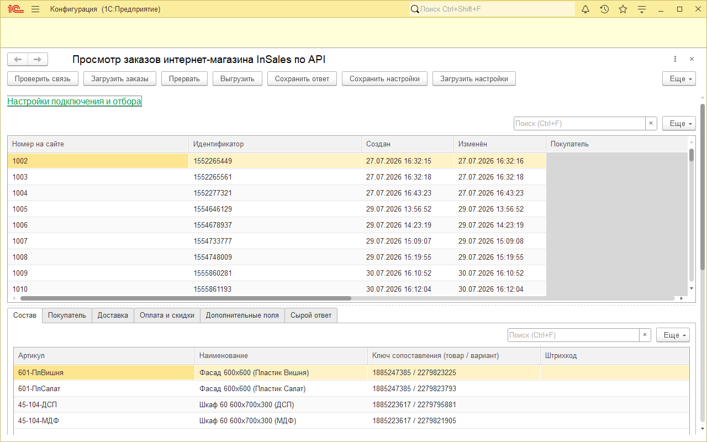
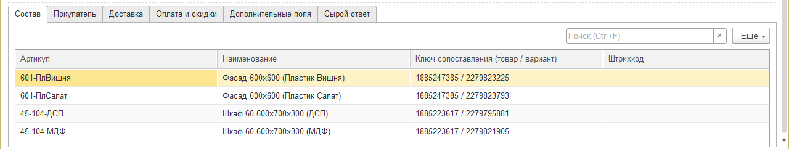

# Просмотр заказов интернет-магазина InSales по API

<!-- publikaciya:start -->

Публикация на Инфостарте: ссылка появится в день выхода.

## Что делает

Обработка забирает заказы InSales за период по API и показывает их в 1С: состав с идентификаторами
товара и варианта, покупателя, доставку, оплату и ответ магазина целиком. С ней удобно оценить обмен
до интеграции, сверить заказы с базой, проверить новый способ доставки или дополнительное поле
и понять, где искать ошибку уже работающего обмена. Документов, справочников и регистров в базе не создаёт
и не меняет, свои настройки хранит в хранилище общих настроек. Один файл .epf, от конфигурации
не зависит, открытый код под MIT.

Рисунок 1. Общий вид: настройки свёрнуты, внизу состав выделенного заказа

Рисунок 2. Вкладка «Состав»: варианты одного товара различаются вторым числом ключа сопоставления

## Чего не делает

- Не записывает в информационную базу прикладные данные (документы, справочники, регистры):
  в базе остаются только настройки обработки, в хранилище общих настроек.
- Не отправляет ничего в магазин: данные магазина только читаются.
- Не хранит пароль ключа доступа: пароль вводится в каждом сеансе и не запоминается.
- Не обращается никуда, кроме адреса магазина, указанного в настройках.

## Что нужно для работы

Проверено: платформа 8.5.1.1343, файловый режим, обычный клиент. Нужен ключ доступа к API магазина
(идентификатор и пароль) и право интерактивного открытия внешних обработок: в типовых базах оно
обычно есть только у администратора. Ключ создаётся в кабинете магазина, в разделе для разработчиков,
пункт «Ключи доступа».

Не проверялось: клиент-серверный режим, веб-клиент, 1С:Фреш, минимальный релиз платформы.

## Где взять собранный файл

Собранный файл .epf лежит в публикации на Инфостарте. Исходники находятся в `src/` в виде выгрузки
в XML: обработку из них собирают в конфигураторе, загрузив внешнюю обработку из файлов XML.

## Персональные данные

Заказ интернет-магазина содержит персональные данные покупателя: имя, телефон, электронную
почту, адрес доставки. Обработка показывает их, выгружает в табличный документ и сохраняет
в файл по команде пользователя. Ответственность за дальнейшее обращение с выгруженными данными
несёт тот, кто их выгрузил.

## Лицензия

MIT, текст в файле [LICENSE](LICENSE).

<!-- publikaciya:end -->
